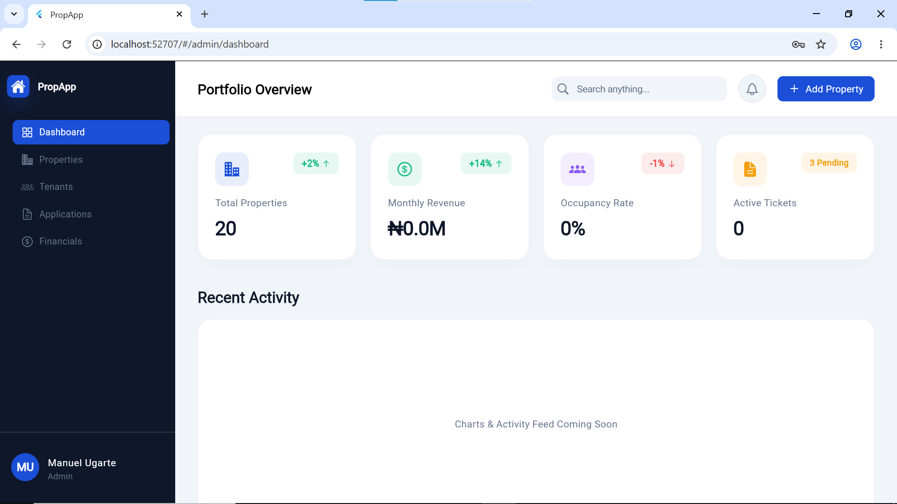
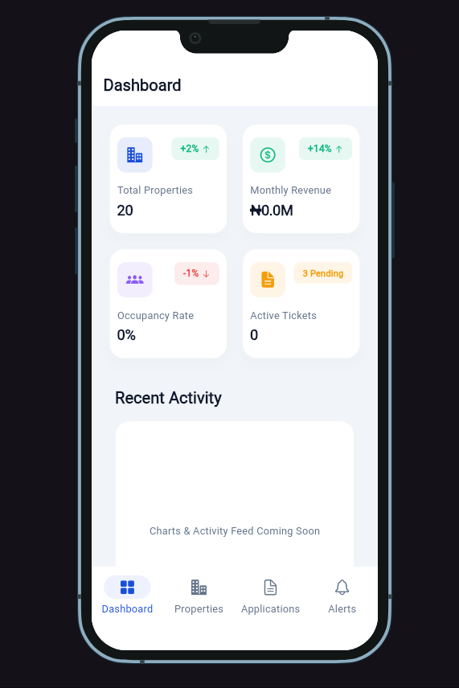
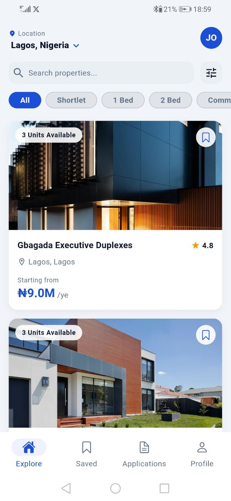
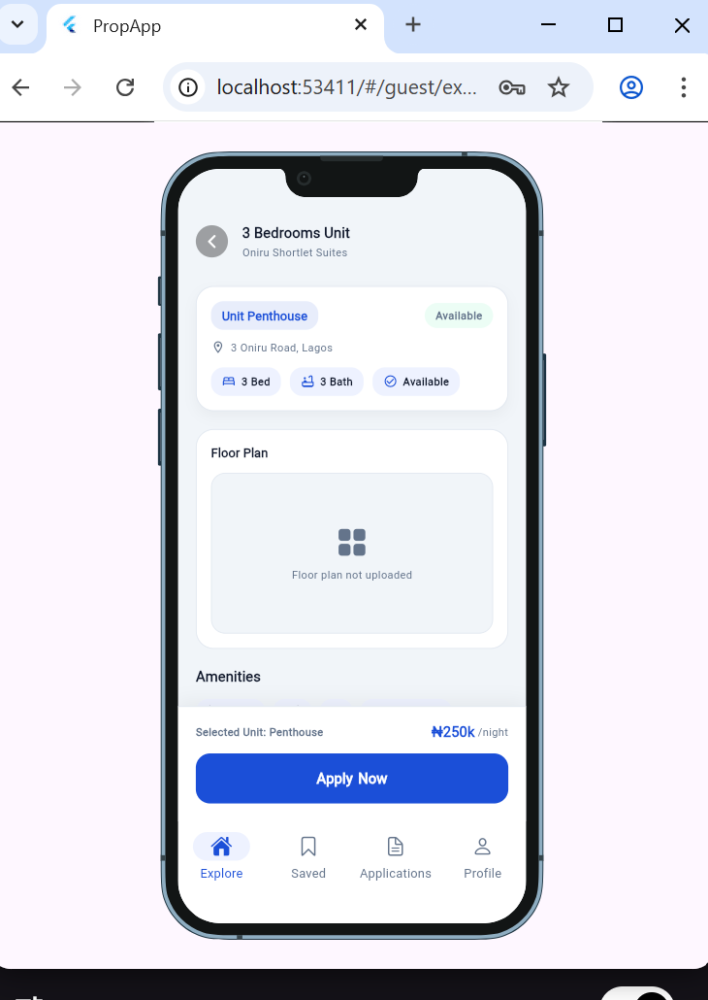
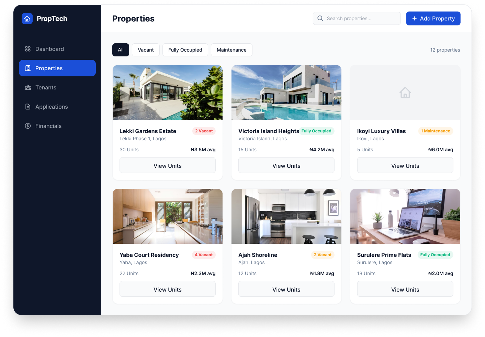
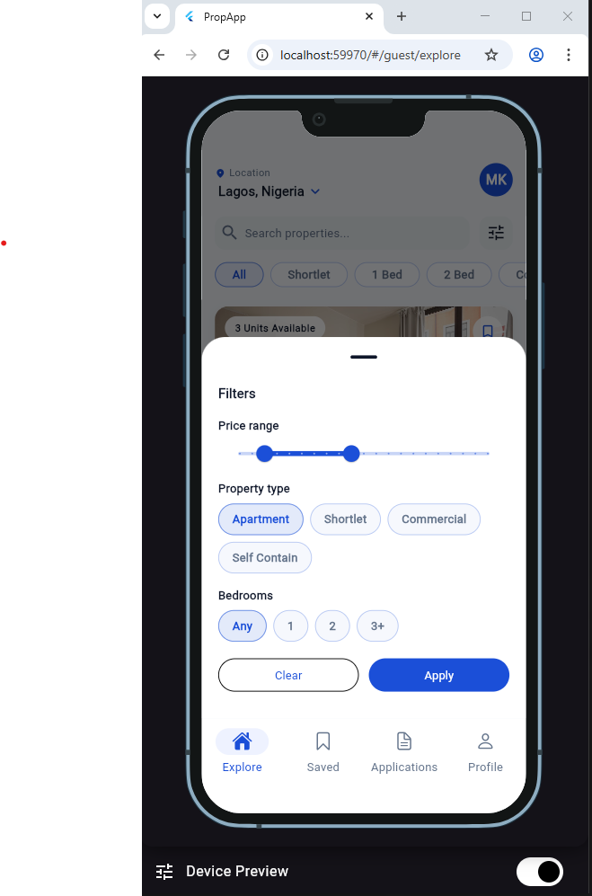

# PropApp

Single-agency property management and marketplace app built with Flutter and
Firebase. Guests browse listings and apply for units, admins review applications
and manage inventory, tenants pay rent and raise maintenance tickets, and staff
handle assigned maintenance tasks.

This is not a multi-landlord SaaS. One agency owns all properties and a small
admin team manages everything.

---

## Table of Contents

- Overview
- Screenshots
- User Roles and Core Flows
- Features
- Tech Stack
- Architecture Rules (Read Before Coding)
- Data Model and Firestore Collections
- Cloud Functions
- Project Structure
- Getting Started
- Firebase Setup
- Running the App
- Functions (Local and Deploy)
- Testing
- Roadmap
- Contributing

---

## Overview

PropApp is a property marketplace and property management tool for a single
agency. It supports mobile and web/tablet layouts and uses Firebase for auth,
storage, data, and server-side workflows. Payments are verified server-side via
webhook and never processed directly in the Flutter client.

---

## Screenshots









---

## User Roles and Core Flows

- Guest
	- Browse properties and units.
	- Apply for a unit.
- Tenant
	- Pay rent and view payment history.
	- Submit and track maintenance tickets.
	- View lease details.
- Staff
	- View assigned maintenance tickets.
	- Update ticket status.
- Admin
	- Manage properties, units, tenants, and applications.
	- Approve applications and create leases.
	- View financial summaries.

---

## Features

- Marketplace browsing with property and unit detail pages.
- Application flow for prospective tenants.
- Tenant dashboard with payments, maintenance, and notifications.
- Staff workflow for maintenance ticket management.
- Admin dashboard and management screens.
- Role-based routing and shells for guest, tenant, staff, and admin.
- Cloud Functions for role management, payments, and automation.

---

## Tech Stack

- Flutter (mobile + web)
- Firebase Auth, Firestore, Storage, Cloud Functions
- Riverpod for state management and DI
- Freezed + JSON Serializable for immutable models
- GoRouter for navigation
- Hive for local storage

---

## Architecture Rules (Read Before Coding)

These rules are enforced across the app:

- Flutter never writes to the `payments` collection. Payments are created by the
	Paystack webhook Cloud Function.
- Flutter never writes `available_units` or `total_units` on properties. Those
	are maintained by a Cloud Function.
- Flutter never sets custom claims. Only Cloud Functions can update Auth claims.
- Always use server timestamps for `created_at` and `updated_at`.
- Riverpod patterns:
	- Provider (DI only, no autoDispose)
	- StreamProvider.autoDispose for real-time Firestore streams
	- FutureProvider.autoDispose for one-time reads
	- StateNotifierProvider.autoDispose.family for data + write actions

---

## Data Model and Firestore Collections

All collections are flat (no subcollections):

```
users
properties
units
applications
leases
payments               (read-only from Flutter)
maintenance_tickets
notifications          (written by Cloud Functions only)
```

### Field Naming Conventions

Firestore uses snake_case, Dart uses camelCase:

```
tenant_id           -> tenantId
property_id         -> propertyId
unit_id             -> unitId
applicant_id        -> applicantId
application_status  -> applicationStatus
unit_status         -> unitStatus
is_published        -> isPublished
available_units     -> availableUnits
created_at          -> createdAt
updated_at          -> updatedAt
```

### Enum Values Stored in Firestore

These strings are stored exactly:

```
UnitStatus:          available | reserved | occupied | maintenance
ApplicationStatus:   pending | interviewPending | approved | rejected | leaseActive | rejectedUnitTaken
LeaseStatus:         pendingPayment | active | expired | terminated
PaymentStatus:       pending | cleared | failed
TicketStatus:        pending | inProgress | resolved
TicketPriority:      low | medium | high
UserRole:            guest | tenant | staff | admin
PropertyType:        apartment | selfCon | commercial | house | shortLet
RentPeriod:          yearly | monthly | weekly | nightly
```

---

## Cloud Functions

Functions are implemented in TypeScript and deployed via Firebase:

- `onUserCreate`: Assigns guest role and creates a user document.
- `onUnitWrite`: Recalculates `total_units` and `available_units` on a property.
- `onApplicationApproved`: Reserves a unit and notifies applicant/admins.
- `onPaymentWebhook`: Verifies Paystack webhook, creates payment doc, activates lease, upgrades role.
- `onLeaseExpiry`: Daily job that expires leases, frees units, and downgrades roles.

---

## Project Structure

```
lib/
	core/
		router/
		theme/
		widgets/
		utils/
	features/
		auth/
		properties/
		units/
		applications/
		leases/
		payments/
		maintenance/
		notifications/
		tenant/
		staff/
		admin/
	navigation/
	main.dart
functions/
	src/
```

---

## Getting Started

### Prerequisites

- Flutter SDK installed
- Firebase CLI installed
- Node.js (for Cloud Functions)

### Install Dependencies

```bash
flutter pub get
```

---

## Firebase Setup

1. Create a Firebase project.
2. Run FlutterFire configuration:

```bash
flutterfire configure
```

3. For Paystack webhook support, configure the secret:

```bash
firebase functions:config:set paystack.secret=sk_live_xxxxx
```

---

## Running the App

```bash
flutter run
```

---

## Functions (Local and Deploy)

```bash
cd functions
npm install
npm run build
npm run serve
```

To deploy:

```bash
cd functions
npm run build
npm run deploy
```

---

## Testing

```bash
flutter test
```

---

## Roadmap

- Complete UI screens for all roles.
- Wire payment workflows with webhook verification.
- Add Firebase emulator testing for role-based routes.

---

## Contributing

1. Create a feature branch.
2. Keep Firestore and role rules intact.
3. Submit a PR with clear screenshots or recordings where applicable.
